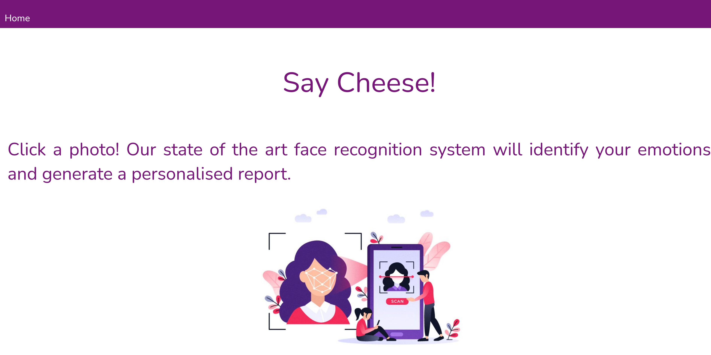

# Emotion Detection
Real-time face detection and emotion classification using fer2013 dataset with a keras CNN model and openCV.

## Installation

Required Python 3.6+
Install the required packages in your local environment (ideally virtualenv, conda, etc.).

```
pip install -r requirements
```

<p align="center">
  
</p>

## Model
FER bundles a Keras model.

The model is a convolutional neural network with weights saved to HDF5 file in the data folder relative to the module's path. It can be overriden by injecting it into the FER() constructor during instantiation with the emotion_model parameter.

## License
[MIT](https://choosealicense.com/licenses/mit/)

## Credits
This code includes methods and package structure derived from Iván de Paz Centeno's implementation of [MTCNN](https://github.com/ipazc/mtcnn/) and Octavio Arriaga's facial expression recognition [repo](https://github.com/ipazc/mtcnn/).

## Reference

FER 2013 dataset curated by Pierre Luc Carrier and Aaron Courville, described in:

"Challenges in Representation Learning: A report on three machine learning contests," by Ian J. Goodfellow, Dumitru Erhan, Pierre Luc Carrier, Aaron Courville, Mehdi Mirza, Ben Hamner, Will Cukierski, Yichuan Tang, David Thaler, Dong-Hyun Lee, Yingbo Zhou, Chetan Ramaiah, Fangxiang Feng, Ruifan Li, Xiaojie Wang, Dimitris Athanasakis, John Shawe-Taylor, Maxim Milakov, John Park, Radu Ionescu, Marius Popescu, Cristian Grozea, James Bergstra, Jingjing Xie, Lukasz Romaszko, Bing Xu, Zhang Chuang, and Yoshua Bengio, arXiv:1307.0414.
